# GeoDrillNet

**CNN + Transformer sequence model for predicting True Vertical Thickness (TVT) along horizontal wells from wireline logs and typewell geological reference curves.**

Horizontal wells are geosteered relative to a target formation, but the True Vertical Thickness to that formation is only known precisely at the reference ("typewell") location — everywhere else it must be inferred from the logs as drilling proceeds. GeoDrillNet frames this as a sequence-regression problem: given per-foot log curves (GR, resistivity, density-neutron pairs), positional/coordinate features, and the typewell's geological offset, predict `Target_TVT` at every point along ~770 training wells.

## Approach

A 1D CNN encoder extracts local log character (bed boundaries, thin markers, curve shape) from sliding windows of the log sequence; a small Transformer stack then attends across the window to capture longer-range structural trends before a regression head predicts TVT per position (`src/geodrillnet_model.py`). Hyperparameters (CNN depth/width, Transformer heads/depth, window size, learning rate, etc.) were selected with a 150-trial Optuna search (15 completed, 135 pruned) under 2-fold cross-validation, then the final architecture was trained with 5-fold `GroupKFold` cross-validation grouped by well, so every well is scored by a model that never saw it during training.

The full pipeline — data loading, feature engineering, fold-safe scaling, windowing, training (AMP + OneCycle LR + early stopping), the Optuna search, and evaluation — is in `notebooks/01_cnn_transformer_tvt_prediction.ipynb`.

## Results — Experiment 008

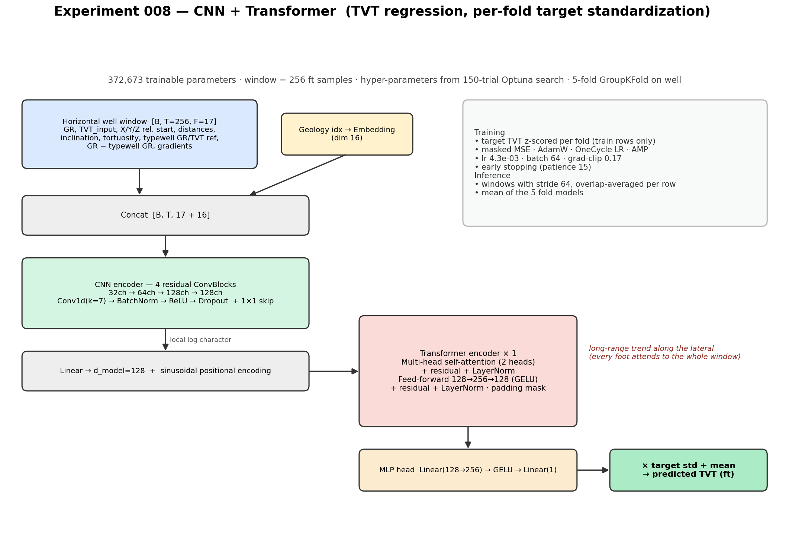

Out-of-fold results, each well scored by a model that never saw it during training:

| Metric | Value |
|---|---|
| RMSE (all rows) | 21.54 ft |
| RMSE after Prediction Start *(the competition scoring region)* | 21.33 ft |
| MAE after Prediction Start | 16.02 ft |
| Median per-well RMSE | 14.48 ft |
| Per-fold RMSE after PS | 19.7 / 20.6 / 24.3 / 20.3 / 21.3 ft |
| Baseline — hold last known TVT constant after PS | **15.91 ft** |

**Honest result:** on this experiment, the learned model is *worse* than the naive "hold last known TVT constant" baseline after the prediction-start point. Training also became unstable in every fold — the loss went to NaN for the last 8–12 epochs (visible as shaded regions below), most likely fp16 AMP overflow at the searched learning rate of 4.3e-3. Early stopping kept the best pre-divergence weights, so the reported metrics are valid, but this points to the target-scaling and AMP setup as the next things to fix rather than the architecture itself.

| Loss curves (NaN epochs shaded) | RMSE per fold vs. baseline |
|---|---|
| 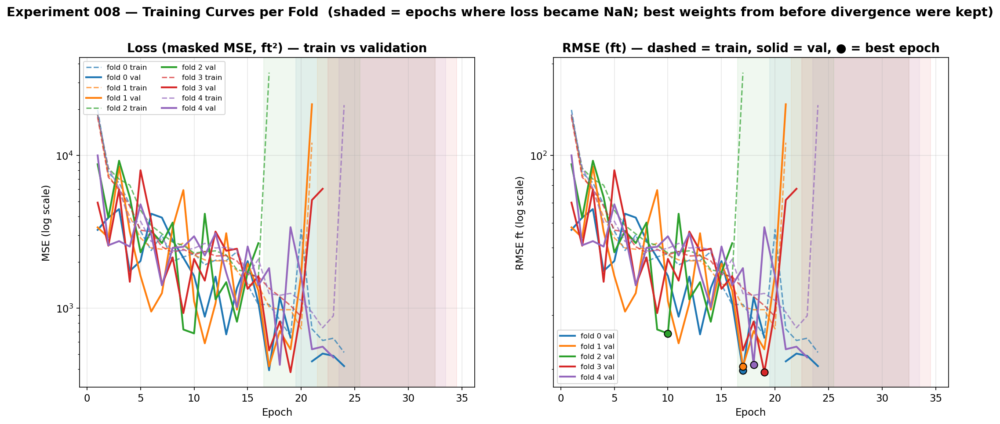 | 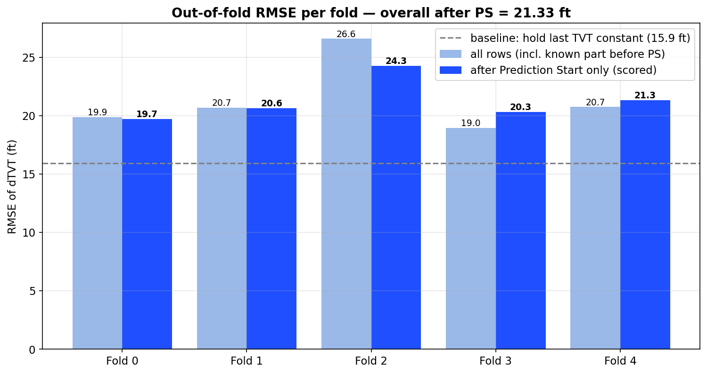 |

| Prediction quality | Per-well RMSE distribution |
|---|---|
| 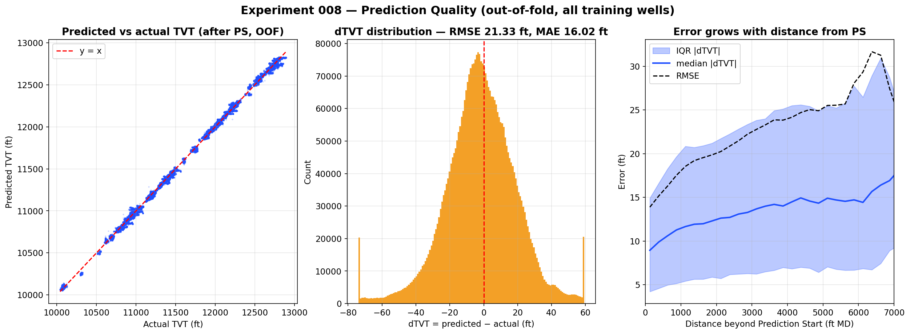 | 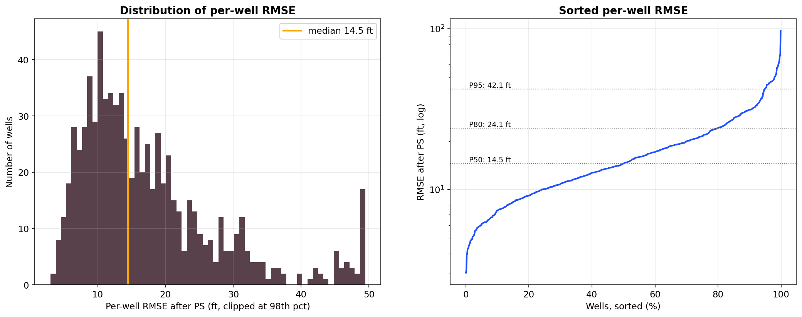 |

| Map view of error by well | 3D view of wells by fold |
|---|---|
| 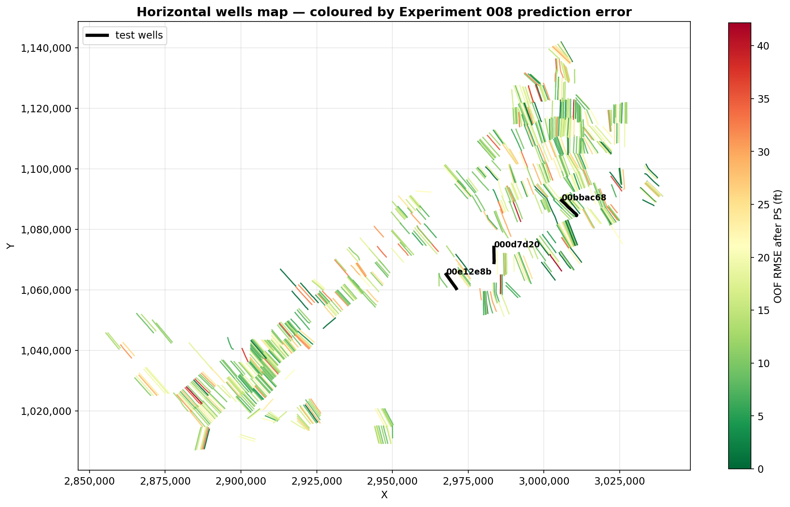 | 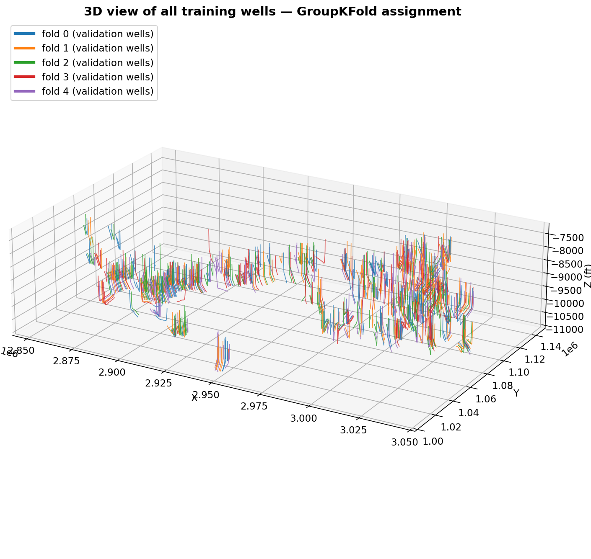 |

Well-level panels (GR log, well path + formation tops, TVT prediction vs. actual) for held-out wells across the difficulty spectrum:

| Good | Typical | Hard |
|---|---|---|
| 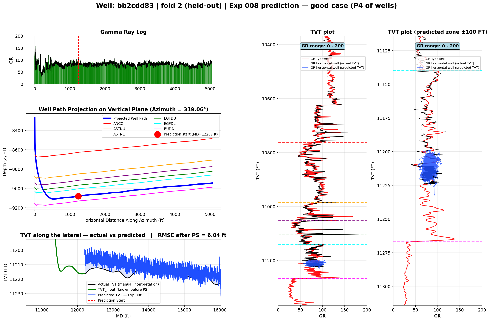 | 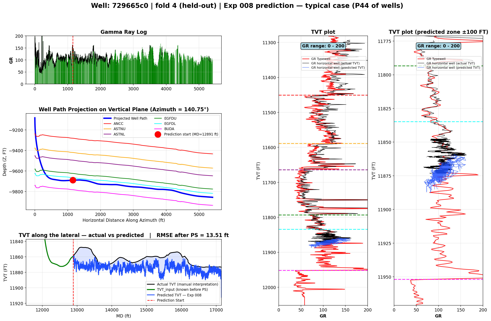 | 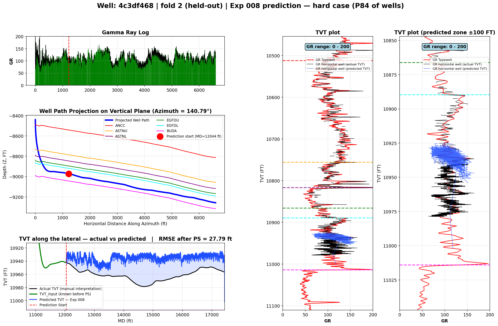 |

| Optuna search history | Self-attention map |
|---|---|
| 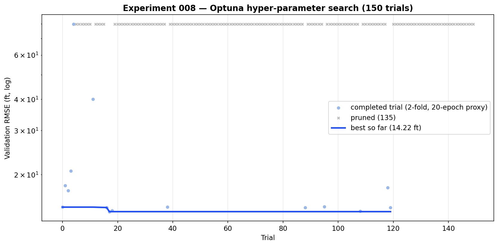 | 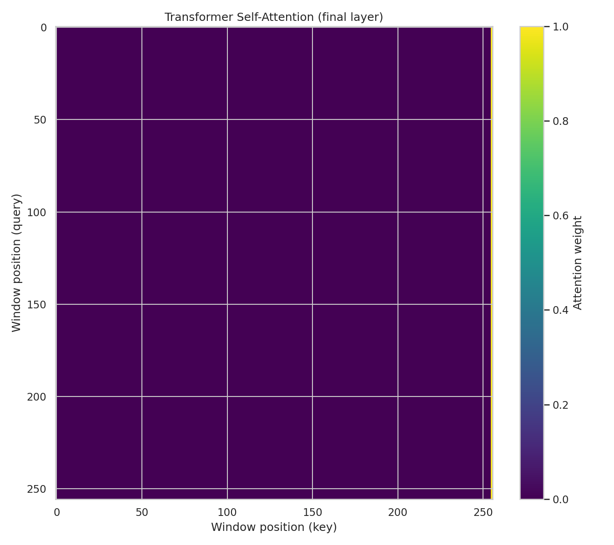 |

The full set of 22 figures, the out-of-fold metrics (`metrics_summary.json`), per-well RMSE (`per_well_rmse_after_ps.csv`), fold loss histories (`fold_histories_from_log.json`), the Kaggle-style submission file, and detailed notes are all in [`results/exp008_cnn_transformer/`](results/exp008_cnn_transformer/).

A print poster summarizing this experiment is in [`poster/`](poster/) (`poster_preview.png`, `poster_preview.pdf`, LaTeX source).

## Repository structure

```
GeoDrillNet/
├── notebooks/
│   └── 01_cnn_transformer_tvt_prediction.ipynb   # full pipeline: data, training, Optuna search, evaluation
├── src/
│   └── geodrillnet_model.py                      # CNN + Transformer model definition (standalone)
├── configs/
│   ├── final_config.json                         # full run configuration (paths, hyperparameters)
│   └── best_params.json                          # Optuna-selected hyperparameters
├── results/
│   └── exp008_cnn_transformer/                   # figures, metrics, per-well RMSE, submission, notes
├── poster/
│   ├── geodrillnet_poster.tex
│   ├── poster_preview.png
│   └── poster_preview.pdf
├── requirements.txt
└── LICENSE
```

## Data

Trained on a horizontal-well wireline-log dataset (`rogii-wellbore-geology-prediction`) — per-foot log curves (GR, resistivity, density-neutron), well coordinates, and typewell geological reference curves for ~770 wells. Raw data is **not included** in this repository — see `.gitignore`. Notebooks expect the dataset under a sibling `../data/rogii-wellbore-geology-prediction/processed_data/` directory; update the path in `configs/final_config.json` / the notebook to point at your own copy to reproduce the pipeline end to end.

## Running

```bash
pip install -r requirements.txt
jupyter lab notebooks/
```

`src/geodrillnet_model.py` is runnable standalone (`python src/geodrillnet_model.py`) to sanity-check the model's forward pass and print its parameter count.

## License

Released under the terms of the [LICENSE](LICENSE) file in this repository. The underlying wellbore dataset remains the property of its original provider.
